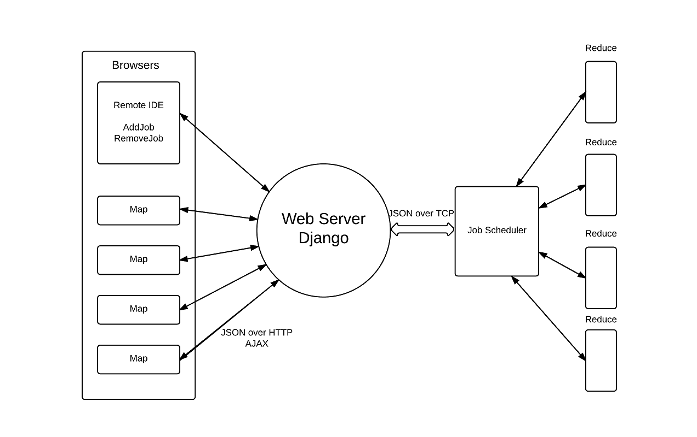

# browser-based-map-reduce

### Framework

###Introduction

There are three major components which define our browser-based MapReduce framework: the browsers, the web server and the job scheduler. 

Client browsers accept tasks (a map function and input data) from the web server, execute the tasks provided to them, and post the results back to the web server continuously through Asynchronous JavaScript and XML (AJAX).

The web server acts as the communication medium between browsers and the job scheduler by providing three services. First, it provides a remote development and job management platform to users. Developers can create browser-based MapReduce programs and add jobs to the job scheduler remotely through the remote development and job management page. Second, the web server pulls tasks from the job scheduler and sends them to the browsers. After a browser sends a get\_task request to the web server, the web server will pull one task from the job scheduler and send the task to the browser. Finally, the web server receives completed results from the browsers and sends them back to the job scheduler.

The job scheduler is the most important and complicated component in our browser-based MapReduce framework. Our job scheduler design emphasizes multithreading. Every time the job scheduler receives a TCP connection request from the web server, the job scheduler will create an Agent to handle this TCP session. If the TCP connection from the web server is for adding a job, the Agent will create a new job and add it to the job queue. If the TCP connection is for getting a task, the Agent will choose a job from the job queue according to our scheduling algorithms and then identify the task of the job, modify relevant task queues, and send the task to the web server. If the TCP connection is for returning a result, the Agent will execute the reduce procedure with this result and record the final outcome.

### Implementation Details

##### Fault Tolerance

Because results from browsers cannot be absolutely trusted, we create three task queues for each job to ensure the eventual execution of all tasks.

The first task queue stores the taskids of all the tasks which have not been assigned to any browser. When a task is assigned to a browser, its taskid will be removed from the first queue and appended to the second queue. Finally, when a task is finished (meaning that a browser has posted back the result of that task), its taskid will be removed from the second queue and added to the third queue. Therefore, the second queue has the taskids of all the tasks which have been assigned but not finished, and the third queue has the taskids of all the tasks which have finished.

If a browser sends request to get a task but does not execute or return the result, this task remains in the second queue and will eventually be assigned to another browser.
##### Asynchronous Return in Map Function

When integrating WebGL acceleration into map functions, an asynchronous return function should be called instead of a common return statement. When the map function returns in a WebGL-accelerated program, the GPU may still be performing computations. In order to make WebGL programs return correct results, the WebGL program should call an asynchronous return function explicitly as soon as the GPU completes its computation.
#####Reduce Function Executed in Server

We decided to execute the reduce function on the server instead of browsers for three reasons. First, letting the reduce function be executed in browsers would result in more complicated system design and imply the need for additional task synchronization. Second, letting the reduce function be executed in browsers will lead to larger overhead caused by additional network transmission of reduce results and/or frequent task synchronization. Finally, letting the reduce function be executed server-side enables the map function and reduce function to be executed simultaneously; otherwise, the reduce procedure has to be executed after all mappers complete.
##### JSON-based Communication

AJAX and JavaScript Object Notation (JSON) are used for communication between browsers and the web server.  JSON over TCP is used for communication between the web server and the job scheduler.

### Example

#### WordCount

~~~~{.javascript}
function __map_function(input)
{
  var split = input.split(" ");
  obj = {};

  for (var x = 0; x < split.length; x++){
    if(obj[split[x]] === undefined){
       obj[split[x]] = 1;
    }
    else{
       obj[split[x]]++;
    }
  }
 return obj;
}
~~~~
~~~~{.python}
def __reduce_function(final_result, task_output):
    for i in task_output:
        if i in final_result:
            final_result[i] += task_output[i]
        else:
            final_result[i] = task_output[i]
    return final_result
~~~~
