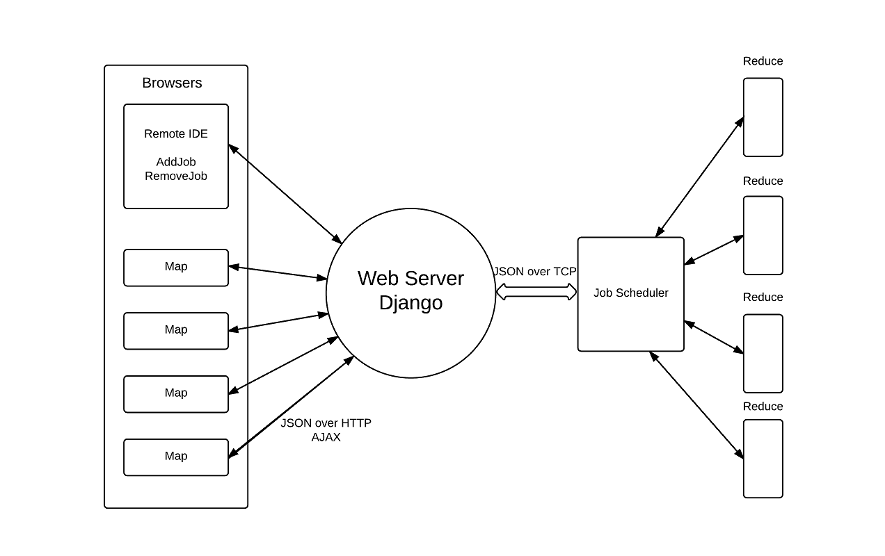

# browser-based-map-reduce

###Framework

###Example

####WordCount

~~~~{.javascript}
function __map_function(input)
{
  var split = input.split(" "),
    obj = {};

  for (var x=0; x<split.length; x++){
    if(obj[split[x]]===undefined){
       obj[split[x]]=1;
    }
    else{
       obj[split[x]]++;
    }
  }
 return obj;
}
~~~~
~~~~{.python}
def __reduce_function(final_result, task_output):
    for i in task_output:
        if i in final_result:
            final_result[i] += task_output[i]
        else:
            final_result[i] = task_output[i]
    return final_result
~~~~
